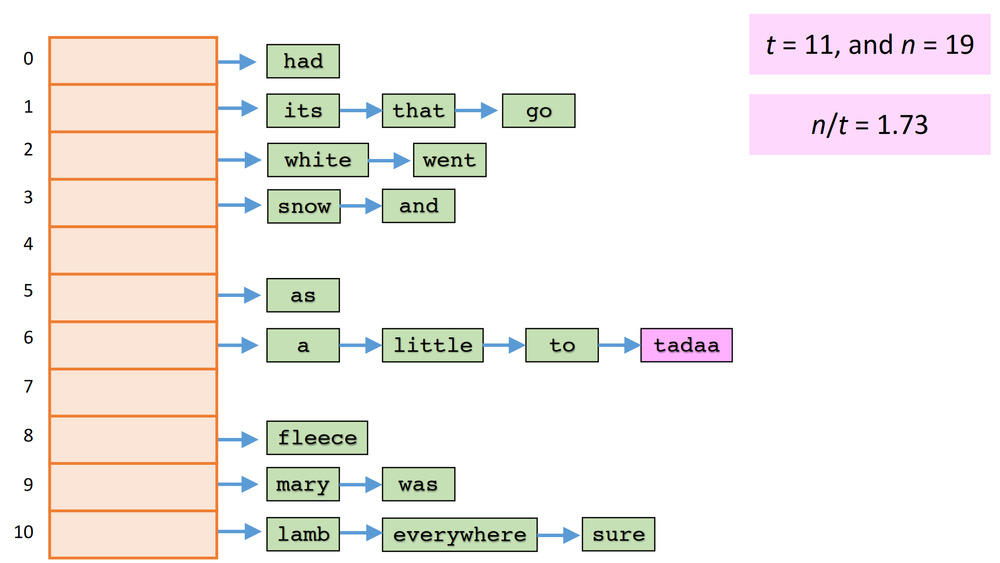

# Hashing Summary

## General overview

Use a hash function `h(x)` to construct a ***random*** integer from any key value.  
Should generate a number `0` to `t-1` such that for `n` keys: 

$$ 0.5 <= n/t <= 4 $$

This way, we can avoid collisions.  

As `n` grows, so to does `n/t`.  
Thus, as it reaches its upper limit of `4`, realloc the main array of seperate chained buckets (linked lists in this case) by a factor of 8.  
After this, you ***must rehash*** all of the `n` items into the larger set. 

>Note: To generate the random integer, use some method that involves a **seed** so it is always reproducable.  
>Make sure to use all the characters of the key and their positions in some way as well!  

 

---

 

## Time complexity analysis 

Dictionary data structures and their complexities:

|Structure|Insert|Search|Delete|Smallest|Next|
|:--:     |:--:  |:--:  |:--:  |:--:    |:--:|
|Unsorted Array|O(1)|O(n)|O(n)|O(n)|O(n)|
|Sorted Array|O(n)|O(logn)|O(n)|O(1)|O(1)|
|Unsorted Linked List|O(1)|O(n)|O(1)|O(n)|O(n)|
|Sorted Linked List|O(n)|O(n)|O(1)|O(1)|O(1)|
|Binary Search Tree|O(n)|O(n)|???|O(n)|O(n)|
|----> BST Average|O(logn)|O(logn)|???|O(logn)|O(logn)|
|Balanced Search Tree|O(logn)|O(logn)|O(logn)|O(logn)|O(1)|
|Hashing|O(n)|O(n)|O(1)|O(n)|O(n)|
|----> Hashing Average|O(1)|O(1)|O(1)|O(n)|O(n)|

 

## Example code

View Alistair's example structures and use for a hash table [at this link](https://people.eng.unimelb.edu.au/ammoffat/teaching/10002/lec11.pdf).  

>Includes creating a hash table (through malloc), searching and inserting.  

 

---

 